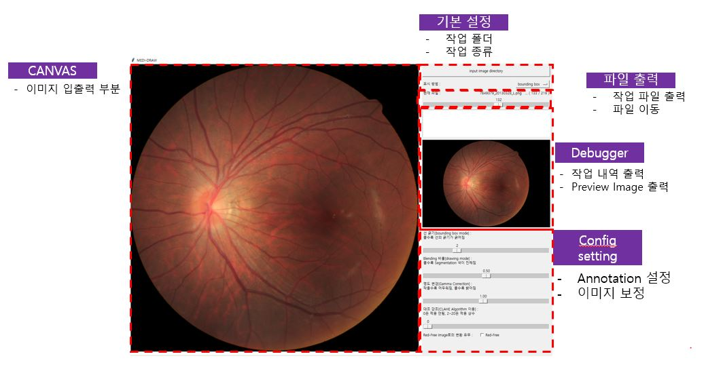
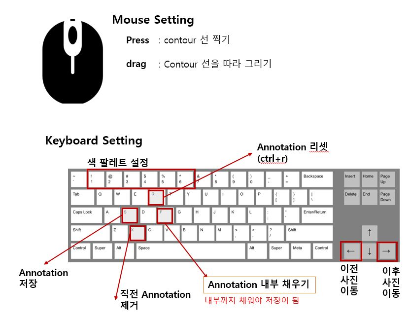

# Medi-Draw


## 화면 구성


## 조작 방법


## 컴파일 방법
```
pyinstaller -F --noconsole --icon="icon.ico" "draw_window.py"
```

## 메소드 구성
#### UI 화면 및 키 구성
1. set_annotation_window : UI 화면 요소
    - 이미지 Canvas 창
    - 조작 Frame 창
        - 설정 및 출력 창
            - 디렉토리 설정 버튼
            - 표기 방식 설정 버튼
            - 파일이름 출력 창
            - 파일 이동 스크롤바
            - 디버거 창
            - 원본 이미지 창
        - 화면 설정 창
            - 선 굵기 설정
            - 마스크 투명도 설정
            - 명도 조절
            - CLAHE 조절
            - RED-FREE 설정

2. bind_key_to_canvas : CANVAS 내 UI 조작 구성
    - 공통
        - move_prev_image & move_next_image :
            파일 변경(변경 내용이 있으면 자동 저장)
        - reset_canvas :
            작업 내역 리셋 (초기 load된 이미지로 돌아감)
        - set_color_type :
            색 변경
        - save_annotation_mask :
            작업 내역 저장

    - boundary box
        - press_bbox :
            Bounding box 시작
        - drag_bbox  :
            Bounding box 늘리고 줄이기
        - drop_bbox :
            Bounding box 결정
        - cancel_bbox_mask :
            이전 Bounding box 취소

    - contour area
        점끼리 자동으로 Smooth하게 선이 이어짐, 선이 이어지고 나서, fill_in_contour하면
        그 안이 채워지는 구조
        - press_contour :
            Contour 점 찍기
        - drag_contour :
            Contour 연속 점 찍기
        - drop_contour :
            <기능 없음>
        - fill_in_contour :
            contour 내부 색 채우기
        - cancel_contour_mask :
            이전 contour 취소

3. bind_key_to_frame : Frame 내 UI 조작 구성
    - select_input_directory :
        우리가 annotating할 이미지가 담긴 디렉토리 설정
    - set_annotation_type :
        annotation type(color) 설정
    - jump_to_image :
        File Scroll바 조작 시 움직임
    - set_line_thickness :
        Line의 두께 설정
    - set_blend_ratio :
        마스크의 투명도 설정
    - set_brightness :
        이미지의 명도 설정
    - set_clahe :
        이미지의 대조 설정
    - set_redfree :
        이미지를 red free 이미지르 변경

#### UI Showing 구성
1. 이미지 관련
    - show_canvas_image :
        화면 내 Canvas(작업 공간) 내에 올려질 Image를 보여주는 메소드
    - show_preview_image :
        화면 내 preview box에 올려진 Image를 보여주는 메소드
    - show_annotation_mask :
        Canvas 위에 User가 그린 annotation을 보여주는 메소드
        - show_bbox_mask    :
            Annotation 중 Boundary box를 보여주는 메소드
        - show_contour_mask :
            Annotation 중 Contour Area를 보여주는 메소드

2. 파일이름 관련
    - show_filename_text :
        화면 내 파일이름을 보여주는 메소드

3. 디버거 관련
    - append_text_debugbox :
        화면 내 debugbox에 글자를 추가하는 메소드
    - clear_debugbox :
        화면 내 debugbox 안 내용을 다 지우는 메소드


#### 파일 저장 및 불러오기
1. 파일 저장
    - save_annotation_mask
        - save_bbox_mask
            - save_bbox_mask_by_csv :
                bounding box의 좌표값을 dataframe형태로 한 후, csv format으로 저장
            - save_bbox_mask_by_image :
                bounding box 안을 채워, png format으로 저장

        - save_contour_mask
            - save_contour_mask_by_npz :
                contour의 좌표값 리스트는 현재
                dict(annotation type별 contour 집합) - list(같은 annotation type의 contour 집합) - np.array(하나의 contour)
                로 구조화되어 구성되어 있음.
                이 구조 그대로 npz format으로 저장
            - save_contour_mask_by_image :
                contour area를 png format으로 저장

2. 파일 불러오기
    - load_annotation_mask
        - load_bbox_mask :
            temp 폴더 내의 bounding box dataframe을 불러옴.
        - load_contour_mask :
            temp 폴더 내의 contour의 구조체를 불러옴.

    - 복원
        - set_bbox_mask :
            현재 저장된 annotation 정보에 따라 해당 annotation type의 bounding box 이미지 복원
        - set_contour_mask :
            현재 저장된 annotation 정보에 따라 해당 annotation type의 contour mask 이미지 복원

3. 작업 내용 초기화
    - init_annotation_mask :
        저장 및 불러오는 작업 시 혼선을 줄이기 위해, 작업 내역을 초기화 하는 작업


#### 이미지 보정
Annotating할 때, 병변 혹은 경계를 확인하기 쉽게 만들기 위해서
이미지를 보정해주는 메소드들
- adjust_image
    - adjust_clahe :
        CLAHE 알고리즘에 따라, 이미지의 경계를 보다 명료하게 만들어줌
    - adjust_gamma_correctin :
        감마 보정 식에 따라, 이미지의 명도를 조절해줌
    - adjust_redfree_image :
        redfree 이미지로 바꾸어줌


#### 키보드 및 마우스 조작 이벤트 리스너
- canvas 관련 이벤트 리스너들
    - 키보드 관련된 이벤트 리스너
        - move_next_image
        - move_prev_image
        - reset_canvas
        - cancel_bbox_mask
        - cancel_contour_mask
        - cancel_current_contour
        - fill_in_contour
        - set_color_type

    - 마우스 관련된 이벤트 리스너
        - press_bbox
        - drag_bbox
        - drop_bbox
        - press_contour
        - drop_contour
        - drag_contour

- Frame 관련 이벤트 리스너들
    - 디렉토리 설정 및 초기 세팅
        - select_input_directory :
            annotating할 이미지가 담긴 디렉토리를 설정

        - set_output_directory :
            작업한 결과물이 저장된 디렉토리 설정
            input directory 내부에 저장
            output 폴더 종류
            temp : 임시 작업 공간 (csv : bounding box의 좌표 저장, npz : contour의 좌표 저장 )
            bounding box : bounding box가 저장된 공간 (annotation type별로 저장)
            contour : contour area가 저장된 공간

        - set_first_image :
            기작업한 내용 다음부터 시작하도록 설정(없으면 처음)

    - set_annotation_type
    - jump_to_image
    - set_line_thickness
    - set_blend_ratio
    - set_brightness
    - set_clahe
    - set_redfree
